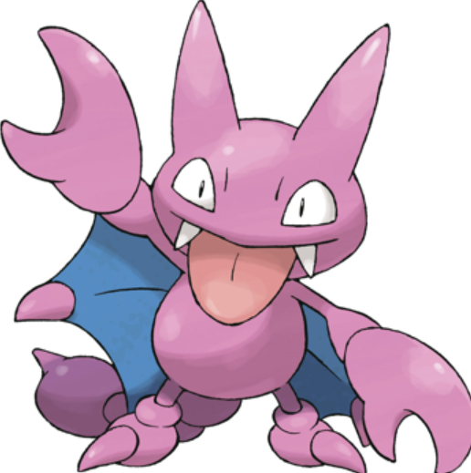

# Image Captioning Analysis

## Overview

This project explores the impact of dataset size and quality on the performance of image captioning models. It consists of three main parts: fine-tuning an image captioning model, analyzing the effects of dataset quantity, and examining the influence of dataset quality.

## Dataset

The dataset used for this project is the **Lambdalabs Pokémon BLIP Captions** dataset, which contains images of Pokémon along with their corresponding captions. This dataset provides a rich source of visual features and descriptive text, enabling effective training of image captioning models. The dataset is split into training (90%) and testing (10%) subsets for model evaluation.

- **Dataset Source**: `lambdalabs/pokemon-blip-captions`
- **Training Size**: 90% of the dataset used for training the model.
- **Testing Size**: 10% of the dataset reserved for evaluation.

## Part 1: Fine-tuning an Image Captioning Model

### Transforms Function

The `transforms` function preprocesses batches of image-text pairs for input into a machine learning model. Its key steps include:

1. **Processing Images and Captions**: Extracts images and captions from the input batch.
2. **Creating Model Inputs**: Prepares the images and captions for model input with padding.
3. **Adding Labels for Training**: Updates the input dictionary to include labels for training.
4. **Function Return**: Returns the processed inputs for model training or inference.

### Compute Metrics Function

The `compute_metrics` function evaluates model performance by calculating the Word Error Rate (WER). Its main steps include:

1. **Unpacking Model Predictions and Labels**: Separates logits and labels from the evaluation predictions.
2. **Generating Predicted Indices**: Identifies the indices of the highest scores from logits.
3. **Decoding Labels and Predictions**: Converts tokenized labels and predictions back into strings.
4. **Calculating Word Error Rate**: Computes the WER to assess model accuracy.
5. **Function Return**: Returns a dictionary with the WER score.

### Example Image

Here’s the image we are trying to generate a caption for:

## Part 2: Impact of Quantity on ML Models

### Generated Captions Analysis

The effect of training data quantity on model performance was analyzed by generating captions with different training examples (400 and 100). Key observations include:

- **Full Dataset Training**: 
  - **Example Caption**: "A pink and blue Pokémon with wings."
  - High accuracy and detailed descriptions, capturing essential attributes accurately.

- **400 Training Examples**: 
  - **Example Captions**:
    - Temperature 0.7: "A pink and blue toy flying through the air."
    - Temperature 0.0: "A pink cartoon character with a pink nose."
    - Temperature 1.0: "A drawing of a purple butterfly with yellow eyes."
  - Maintained accurate color identification but began to show less specificity in details, such as misidentifying features.

- **100 Training Examples**: 
  - **Example Captions**:
    - Temperature 0.7: "A cartoon character with blue eyes."
    - Temperature 0.0: "A drawing of a blue and white bird with a red tail."
    - Temperature 1.0: "A cartoon drawing of a white monster."
  - Significant loss of accuracy, leading to overly simplistic and generic descriptions that fail to capture the unique characteristics of the images.

This analysis emphasizes that larger datasets contribute to improved accuracy and context in generated captions, while smaller datasets can lead to oversimplification and loss of essential details.

## Part 3: Impact of Quality on ML Models

### Quality Analysis of Generated Captions

When analyzing captions generated from filtered versus complete datasets, specific keywords were removed from the training examples, including "pink," "blue," "dragon," and "pokemon." The following observations were made:

- **Full Dataset Training**: Accurately captures essential attributes and details of the images.
- **Filtered Dataset Training**: Produces generic and irrelevant captions, significantly lacking in detail and specificity. For example, the filtered dataset led to captions such as "a drawing of a cat with a cartoon character on it," rather than capturing the unique aspects of the Pokémon.

This highlights the critical role of dataset quality and diversity in training machine learning models. Models trained on high-quality datasets are better equipped to generate accurate and contextually relevant captions.

## Conclusion

This project demonstrates the vital importance of both the quantity and quality of training datasets in developing effective image captioning models. By understanding and addressing these factors, we can enhance model performance and improve the generation o
